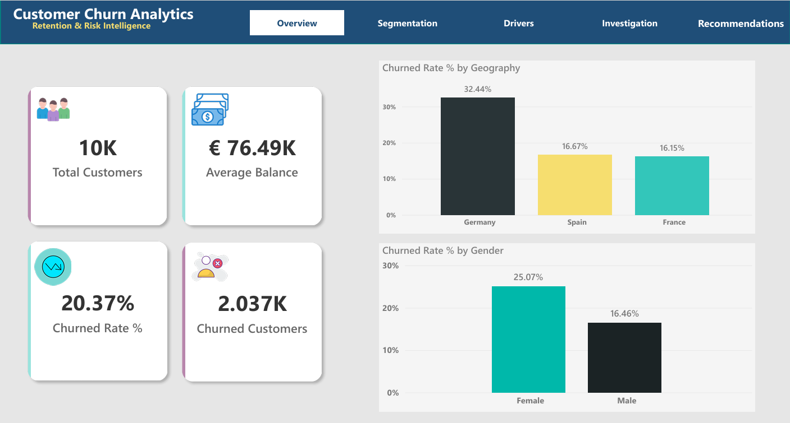
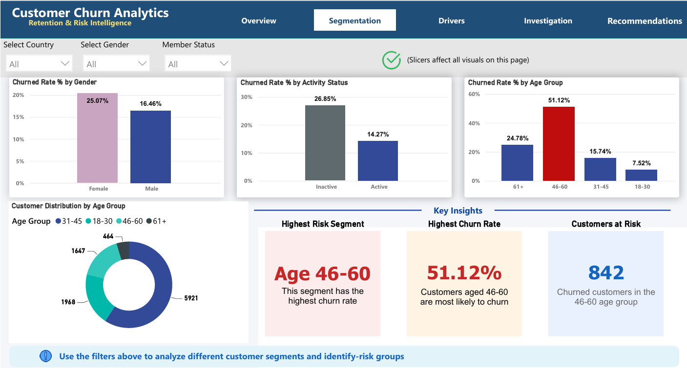
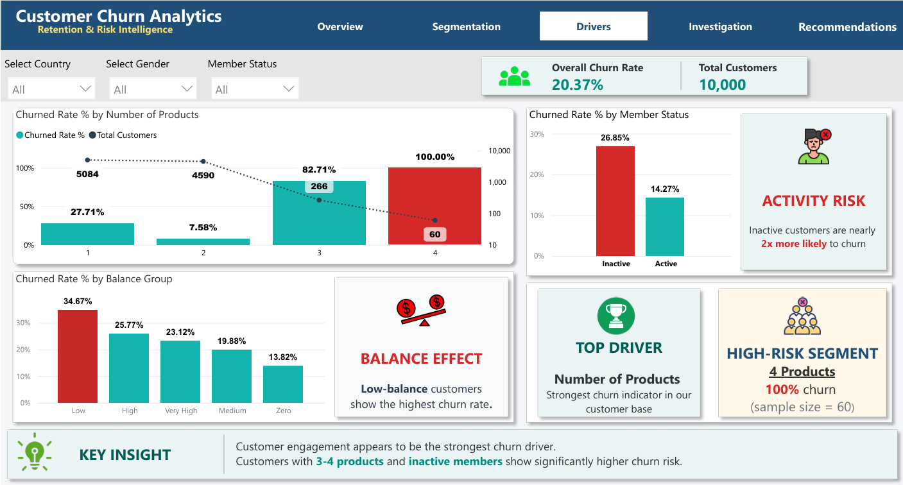
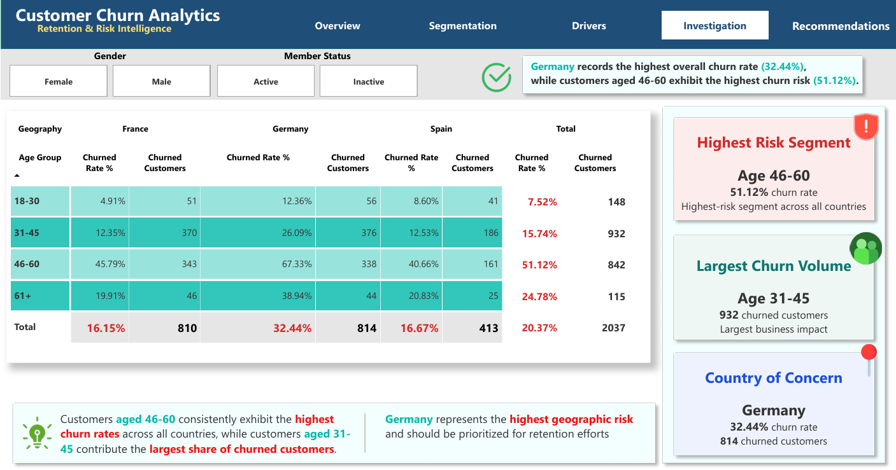
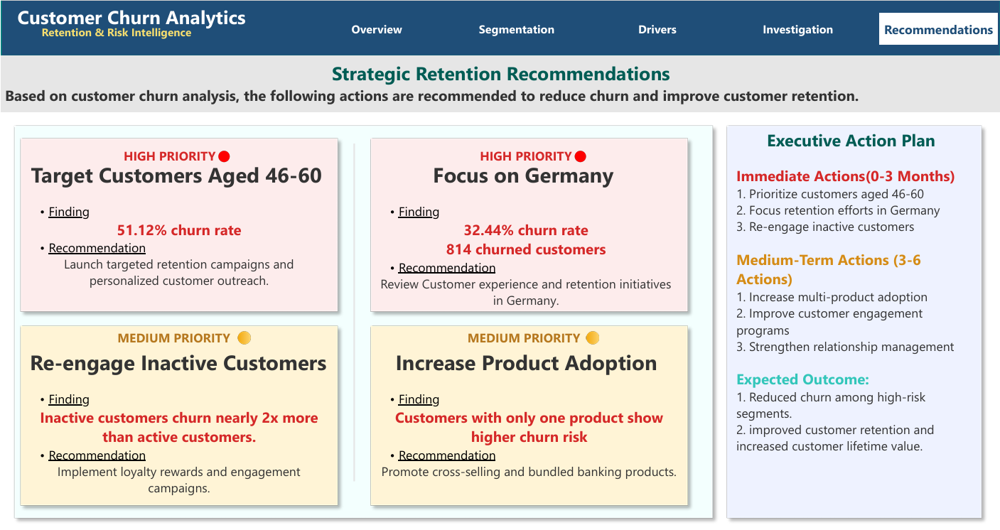

# Customer Churn Analysis Dashboard

## Overview

This project presents an end-to-end Customer Churn Analysis Dashboard developed in Power BI to identify customer attrition patterns, uncover key churn drivers, and provide actionable retention strategies.

The dashboard analyzes customer demographics, product ownership, account activity, balance levels, and geographic distribution to answer critical business questions related to customer retention.

---

## Business Problem

Customer churn directly impacts revenue, customer lifetime value, and long-term business growth.

The objective of this project is to identify:

* Which customer segments are most likely to churn.
* What factors contribute most to customer attrition.
* Which customer groups should be prioritized for retention efforts.
* What business actions can reduce future churn.

---

## Project Objectives

* Calculate overall churn performance.
* Identify high-risk customer segments.
* Analyze churn across geography, age groups, activity status, and product ownership.
* Investigate customer behavior patterns associated with churn.
* Provide data-driven retention recommendations.

---

## Business Questions

### 1. What is the overall churn rate?

The dashboard measures the percentage of customers who exited the bank.

### 2. Which customer segment has the highest churn risk?

Identify demographic groups with the highest churn rates.

### 3. Which country has the highest churn rate?

Compare churn behavior across France, Germany, and Spain.

### 4. Does customer activity influence churn?

Evaluate the relationship between active membership and churn likelihood.

### 5. Does product ownership affect churn?

Determine whether customers with fewer banking products are more likely to leave.

### 6. How does account balance relate to churn?

Analyze balance groups to understand financial behavior associated with churn.

---

## Dataset

The project uses a customer churn dataset containing:

* Customer Demographics
* Geography
* Gender
* Age
* Credit Score
* Balance
* Number of Products
* Active Membership Status
* Estimated Salary
* Exit Status

Dataset file:

```text
Dataset/churn dataset.xlsx
```

---

## Data Preparation

The dataset was cleaned and transformed using Power Query.

Key preparation steps included:

* Data quality validation
* Data type corrections
* Creation of calculated columns
* Customer segmentation grouping
* Age group categorization
* Balance group categorization
* Member status classification
* Credit score grouping

---

## Data Model

A Star Schema model was implemented to improve performance and maintain analytical flexibility.

### Fact Table

* FactCustomer

### Dimension Tables

* DimGeography
* DimGender
* DimAge Group

The model supports efficient filtering and interactive analysis across all dashboard pages.

---

# Dashboard Pages

## 1. Overview

Provides a high-level summary of customer churn performance, customer volume, average balance, and geographic distribution.



### Key Insights

* Overall churn rate: 20.37%
* Germany records the highest churn rate (32.44%).
* Female customers churn more frequently than male customers.

---

## 2. Customer Segmentation

Analyzes churn across customer demographics and behavioral segments.



### Key Insights

* Customers aged 46-60 exhibit the highest churn rate.
* Inactive customers are significantly more likely to churn.
* The 31-45 age segment contains the largest number of churned customers.

---

## 3. Churn Drivers

Identifies the strongest factors contributing to customer attrition.



### Key Insights

* Inactive membership is a major churn driver.
* Customers with 3-4 products show elevated churn risk.
* Low-balance customers demonstrate higher churn rates.
* Product ownership strongly influences customer retention.

---

## 4. Customer Investigation

Provides detailed drill-down analysis across geography, age groups, and membership status.



### Key Insights

* Germany represents the highest geographic churn risk.
* Customers aged 46-60 consistently show the highest churn rates.
* Customers aged 31-45 account for the largest share of churned customers.

---

## 5. Recommendations

Transforms analytical findings into actionable business recommendations.



### High Priority Actions

* Target customers aged 46-60 with retention campaigns.
* Prioritize churn reduction initiatives in Germany.

### Medium Priority Actions

* Re-engage inactive customers.
* Increase product adoption through cross-selling strategies.

---

# Key Findings

### Highest Risk Segment

* Age Group: 46-60
* Churn Rate: 51.12%

### Largest Churn Volume

* Age Group: 31-45
* Churned Customers: 932

### Highest Geographic Risk

* Country: Germany
* Churn Rate: 32.44%

### Activity Impact

* Inactive customers are nearly twice as likely to churn compared to active customers.

### Product Impact

* Customers with multiple products demonstrate significantly different churn behavior, highlighting product ownership as a key retention factor.

---

# Strategic Recommendations

### Immediate Actions

1. Focus retention efforts on customers aged 46-60.
2. Launch targeted retention programs in Germany.
3. Re-engage inactive customers through personalized campaigns.

### Medium-Term Actions

1. Improve customer engagement programs.
2. Promote additional product adoption.
3. Enhance customer relationship management initiatives.

---

# Tools & Technologies

* Power BI
* Power Query
* DAX
* Microsoft Excel
* GitHub

---

# Skills Demonstrated

* Data Cleaning
* Data Modeling
* Star Schema Design
* DAX Measures
* Power Query Transformation
* Business Intelligence
* Data Visualization
* Customer Analytics
* Dashboard Design
* Business Recommendation Development

---

# Repository Structure

```text
Churn-Analysis-PowerBI
│
├── Dashboard
│   └── Churn Analysis.pbix
│
├── Dataset
│   └── churn dataset.xlsx
│
├── Screenshots
│   ├── Overview.png
│   ├── customer-segmentation.png
│   ├── churn-drivers.png
│   ├── customer-investigation.png
│   └── Recommendations.png
│
└── README.md
```

---

# Project Outcome

This project successfully identified the most vulnerable customer segments and translated analytical findings into practical retention strategies.

The dashboard enables stakeholders to quickly understand customer churn patterns, prioritize retention efforts, and support data-driven decision-making.

